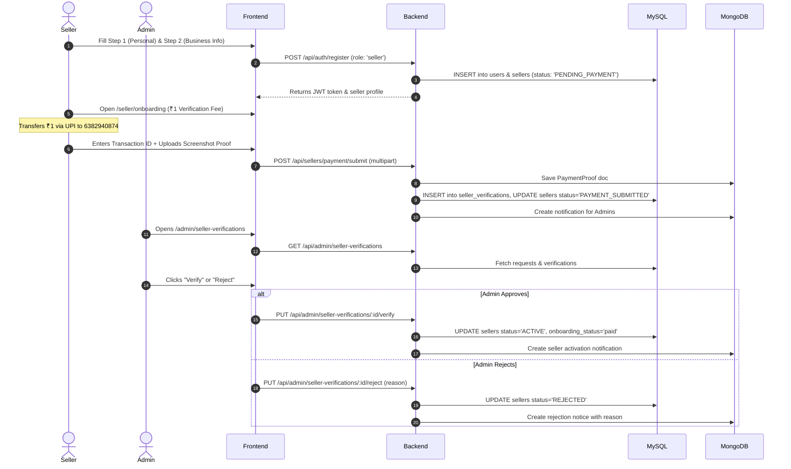

# FlipMyCart - Project Documentation

## 1. Executive Summary

**FlipMyCart** is a production-grade, full-stack multi-vendor e-commerce marketplace platform engineered using the **MERN + MySQL** stack with **Polyglot Persistence**. The platform bridges buyers and independent sellers directly with zero middleman commissions on sales, guaranteed authentic products, a multi-step seller verification and onboarding mechanism, and a real-time 5-dimensional marketplace analytics engine.

---

## 2. Technology Stack Architecture

### Frontend
- **Framework**: React 18 with Vite for high-performance builds and HMR.
- **Routing**: React Router v6 with declarative Protected Routes and Role-Based Guards (`RoleRoute`).
- **State Management**: React Context API (`AuthContext`, `CartContext`, `NotificationContext`).
- **Data Visualization**: Recharts for responsive, interactive charting (Area, Line, Bar, Pie charts).
- **Icons**: Lucide React for modern UI icons.
- **Styling**: Vanilla CSS with customized FlipMyCart design tokens (Dark Navy `#172A46`, Orange Gradient `#FF7A45` $\to$ `#FF5C1A`, Background `#F5F7FB`).

### Backend
- **Runtime**: Node.js (v18+ recommended).
- **Framework**: Express.js REST API with centralized asynchronous error handling (`asyncHandler`, `ApiError`).
- **Authentication**: Stateless JSON Web Tokens (JWT) stored in localStorage / HTTP headers, bcrypt password hashing.
- **File Handling**: Multer middleware with dedicated storage destinations for product media (`/uploads/products/`) and seller verification receipts (`/uploads/proofs/`).

### Database & Polyglot Persistence
- **Relational (MySQL 8.0+)**: Structured business entities with ACID transactions and referential integrity (Users, Sellers, Seller Verifications, Categories, Products, Carts, Orders, Payments, Support Tickets).
- **NoSQL (MongoDB 6.0+)**: Unstructured, polymorphic, high-volume clickstream, and media data (Payment Proofs, Product Media, Product Specifications, Reviews, Chat Messages, User Activities, In-App Notifications).

---

## 3. User Roles & Capabilities Matrix

| Feature / Capability | Guest | Buyer | Seller | Admin | Support |
| :--- | :---: | :---: | :---: | :---: | :---: |
| Browse & Search Products | ✅ | ✅ | ✅ | ✅ | ✅ |
| Filter by Category, Price & Stock | ✅ | ✅ | ✅ | ✅ | ✅ |
| Sort Products (Price, Name, Date) | ✅ | ✅ | ✅ | ✅ | ✅ |
| View Product Details & Specs | ✅ | ✅ | ✅ | ✅ | ✅ |
| Cart & Wishlist Management | ❌ | ✅ | ❌ | ❌ | ❌ |
| Checkout & Place Orders | ❌ | ✅ | ❌ | ❌ | ❌ |
| Submit Product Reviews | ❌ | ✅ | ❌ | ❌ | ❌ |
| Message Sellers Directly | ❌ | ✅ | ✅ | ❌ | ❌ |
| Multi-Step Registration & ₹1 Payment | ❌ | ❌ | ✅ | ❌ | ❌ |
| Product Catalog Management (CRUD) | ❌ | ❌ | ✅ (Active) | ✅ (Mod) | ❌ |
| Fulfill Assigned Order Items | ❌ | ❌ | ✅ (Active) | ❌ | ❌ |
| Seller Dashboard & Sales Analytics | ❌ | ❌ | ✅ (Active) | ❌ | ❌ |
| Seller Verification Hub (Verify/Reject) | ❌ | ❌ | ❌ | ✅ | ❌ |
| Platform-Wide 5-Tab Analytics | ❌ | ❌ | ❌ | ✅ | ❌ |
| Manage Users & Moderate Products | ❌ | ❌ | ❌ | ✅ | ❌ |
| Ticket Management & Resolution | ❌ | ❌ | ❌ | ❌ | ✅ |

---

## 4. Multi-Step Seller Registration & Verification Workflow



---

## 5. Security & Authentication Model

1. **Password Hashing**: Passwords hashed with bcrypt using salt factor 10 before storage in MySQL.
2. **Stateless JWT**: Standard Bearer token authentication containing `userId` and `role`. Verified per request by `authenticate` middleware.
3. **Role Guards**: Express middleware `authorize('admin')`, `authorize('seller')`, etc., enforce strict endpoint isolation.
4. **Seller State Guard (`requireActiveSeller`)**: Verifies in MySQL that seller status is `ACTIVE` before permitting product insertion, update, media upload, or order status changes.
5. **Data Sanitization**: Sensitive database fields (`password_hash`, reset tokens) stripped from API responses via `sanitizeUser()`.

---

## 6. Directory Organization Standard

```
FlipMyCart/
├── backend/            # Express REST API, Controllers, Services, Models, Routes
├── frontend/           # React 18 + Vite SPA, Components, Contexts, Pages
├── docs/               # Architecture, Database, API, & Polyglot documentation
├── README.md           # Master project manual & setup instructions
├── .gitignore          # Root ignore patterns
└── package.json        # Unified project script runner
```
